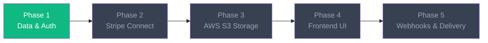

# 🚀 Digital Product Storefront — Architecture Guide

A production-ready micro-SaaS platform: a **$0 transaction fee** alternative to Gumroad.
Creators pay a flat **$19/mo** subscription and connect their own Stripe accounts to receive buyer payments directly.

---

## 📐 Tech Stack

| Layer | Technology | Purpose |
|:---|:---|:---|
| **Frontend** | Next.js (React + Tailwind CSS + TypeScript) | App Router, SSR, dynamic storefronts |
| **Backend** | Node.js (Express + TypeScript) | REST API, auth, webhooks |
| **Database** | Supabase (PostgreSQL) | Managed Postgres with auth/storage add-ons |
| **ORM** | Prisma | Type-safe database access + migrations |
| **Payments** | Stripe Connect Standard + Stripe Billing | Creator payouts + platform SaaS fees |
| **File Storage** | AWS S3 + CloudFront | Private buckets, presigned URLs for secure delivery |

---

## 📁 Project Structure

```
project-root/
├── frontend/                    # Next.js (React + Tailwind CSS)
│   ├── src/app/                 # App Router pages
│   ├── src/components/          # Reusable UI components
│   ├── src/lib/                 # Utility functions, API client
│   └── public/                  # Static assets
├── backend/                     # Node.js (Express + TypeScript)
│   ├── prisma/
│   │   └── schema.prisma        # Database schema
│   ├── src/
│   │   ├── index.ts             # Express entry point
│   │   ├── config/env.ts        # Environment variable loader
│   │   ├── middleware/auth.ts   # JWT auth middleware
│   │   ├── routes/auth.ts       # Auth routes (register, login, me)
│   │   ├── routes/products.ts   # Product CRUD routes
│   │   └── lib/prisma.ts        # Prisma client singleton
│   └── package.json
├── .env                         # Environment variables (never commit)
├── .env.example                 # Template for .env
├── .gitignore
└── CLAUDE.md                    # This file
```

---

## 🔧 Development Commands

### Backend
```bash
cd backend
npm run dev          # Start dev server with hot-reload (port 4000)
npm run build        # Compile TypeScript to dist/
npm run start        # Run compiled JS
npm run db:push      # Push Prisma schema to Supabase
npm run db:generate  # Regenerate Prisma Client
npm run db:studio    # Open Prisma Studio (GUI)
```

### Frontend
```bash
cd frontend
npm run dev          # Start Next.js dev server (port 3000)
npm run build        # Production build
npm run start        # Serve production build
```

---

## 🛣️ API Endpoints (Phase 1)

### Authentication
| Method | Endpoint | Auth | Description |
|:---|:---|:---|:---|
| `POST` | `/api/auth/register` | ❌ | Register a new creator account |
| `POST` | `/api/auth/login` | ❌ | Login and receive JWT |
| `GET` | `/api/auth/me` | ✅ | Get current user profile |

### Products (CRUD)
| Method | Endpoint | Auth | Description |
|:---|:---|:---|:---|
| `GET` | `/api/products` | ✅ | List creator's products |
| `GET` | `/api/products/:id` | ✅ | Get single product |
| `POST` | `/api/products` | ✅ | Create a new product |
| `PUT` | `/api/products/:id` | ✅ | Update a product |
| `DELETE` | `/api/products/:id` | ✅ | Delete a product |

---

## 📋 Phased Build Plan



| Phase | Scope | Status |
|:---|:---|:---|
| **Phase 1** | Prisma + Supabase, JWT Auth, Product CRUD | ✅ Built |
| **Phase 2** | Stripe Connect onboarding, SaaS subscription webhooks | ✅ Built |
| **Phase 3** | AWS S3 presigned upload/download, secure delivery | ✅ Built |
| **Phase 4** | Creator Dashboard, Public Storefront, Checkout UI (Reference: [Coolify UI Redesign](https://dribbble.com/shots/25289925-Coolify-UI-Redesign)) | ⏳ Next |
| **Phase 5** | Purchase webhooks, order creation, email delivery | ⏳ Pending |

---

> [!IMPORTANT]
> **Before running the backend**, you must:
> 1. Copy `.env.example` → `.env`
> 2. Fill in your **Supabase DATABASE_URL**
> 3. Set a strong **JWT_SECRET**
> 4. Run `cd backend && npm run db:push` to sync the schema